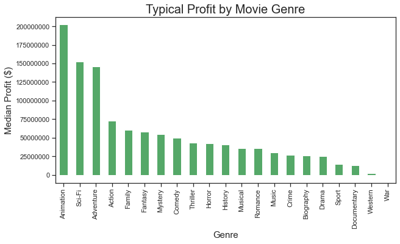
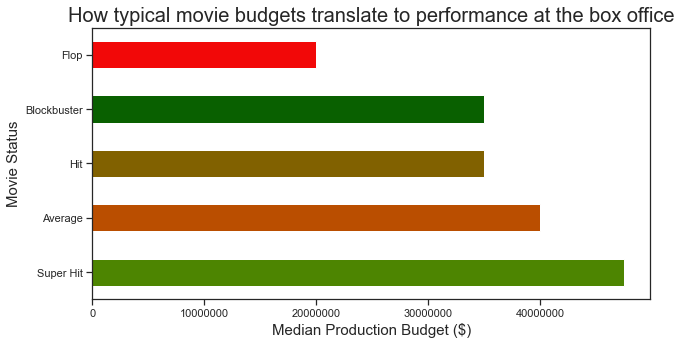

# Microsoft Movie Studio Analysis
*Author:* [Robert Harrow](mailto:rharrow928@gmail.com)

## Overview

This project analyzes major motion picture performence from 2010 through 2019 for the benefit of Microsoft's new movie studio. The descriptive analysis finds that certain movie generes, directors and levels of monetary investment produce significantly better results. Microsoft can use this analysis to adjust their investment strategy and approporiately allocate their resources for their new venture.

## Business Problem

The movie industry is highly competitive. In recent years, tech companies like Amazon and Netflix have invested significant money into the production of movies and shows. If Microsoft's new movie studio is to be competitive, it needs to use data to its advantage and figure out where to pool their resources, which types of movies to bet on and which directors to work with.

## Data

This analysis looked at data from IMDB which contained descriptive statistics on things such as a movie's genre, director, year of release and more.

This data was combined with a dataset from The-Numbers.com, which included figures on each movie's budget and worldwide box office performance.

To avoid noise from smaller productions, the dataset excluded independent films (defined as movies with a production budget below $2,000,000).

The combined dataset was able to match 1,167 films from 2010 through 2019.

## Methods

The project involved creating new data features and bucketing performance of different genres, directors and spending levels into these different feature categories.

First, the project defined movie status categories that depend on how much worldwide revenue each film produced relative to its production budget. These definitions were obtained from <a href="https://www.quora.com/What-are-the-criteria-for-a-movie-hit-super-hit-blockbuster-and-flop" target="_blank">Quora</a>.

* Flop: colelcted less than 100% of its production budget
* Average: collected 100% to 125% of its production budget
* Hit: collected 125% to 175% of its production budget
* Super Hit: collected 175% to 200% of its production budget
* Blockbuster: collected over 200% of its production budget

The project also defined each title's profit as its worldwide box office gross minus the production budget.

The above data was analyzed to produce this project's recommendations.

## Results

Animated films, action movies and Sci-Fi films are the 3 top performing categories.




Steven Spielberg produced more blockbusters between 2010 and 2019 than any other director included in this analysis. Mr. Spielberg along with others identified in our top 5 are prime candidates for Microsoft to partner with on a feature film.


A movie's budget and its worldwide box office performance were strongly correlated. Looking at the typical budget of a blockbuster, Microsoft should expect to spend $35M on each feature film that it hopes to reach this coveted status.




## Conclusions

This analysis leads to three recommendations for launching Microsoft's new movie studio:

* Spend at least $35M per film. It's clear from the data that both profit and worldwide revenue have a strong positive correlation with a movie's production budget. The median production budget of a blockbuster was $35M, while the median production budget of a movie considered to be a "Flop" was just $20M.
* Work with proven directors like Steven Spielberg. Mr. Spielberg along with directors like Clint Eastwood and Jon Chou stand head and shoulders above the rest in terms of consistently producing blockbusters. Their names carry weight and are clearly a draw for audiences.
* Focus on Animated movies. These films produced the highest returns at the box office. If the brand wants to focus on live action films, then Adventure, Sci-Fi and Action movies are the next best thing.

### Next Steps

Further analysis could yield additional insights for Microsoft:
* Increasing the sample size. Scraping additional data to produce a larger sample can help us dive deeper into differences between genres.
* Look into year-to-year changes in performance. This project analyzed the bucket of movies between 2010 and 2019. A time analysis could help Microsoft get ahead of changing trends if we were to spot shifting audience preferences.
* Predict flops. Further modeling could be done to detect features commonly present in flops. This could help Microsoft decide which projects to greenlight and which ones to shut down before production begins.


## For more information

See the full analysis in the [Jupyter Notebook](https://github.com/robertharrow/flatiron-phase-1-project/blob/main/microsoft_movie_studio_analysis.ipynb) or review [this presentation](https://github.com/robertharrow/flatiron-phase-1-project/blob/main/presentation.pdf).

For additional info, contact Robert Harrow at rharrow928@gmail.com.

### Repository Structure
```
├── data
├── images
├── README.md
├── presentation.pdf
└── microsoft_movie_studio_analysis.ipynb
```